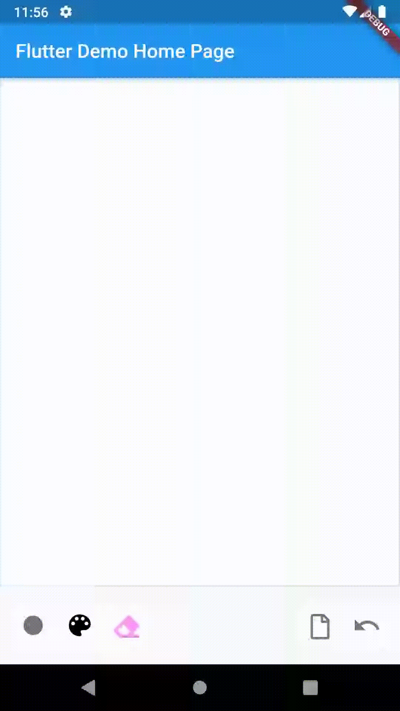

# whiteboardkit

A Flutter whiteboard widget with so much extendability and flexibility to be used with no need to rewrite your own whiteboard. Enjoy !

  

live demo: [https://abdulaziz-mohammed.github.io/whiteboardkit](https://abdulaziz-mohammed.github.io/whiteboardkit)
# Usage

import whiteboardkit.dart

```dart
import 'package:whiteboardkit/whiteboardkit.dart';
```

&nbsp;
&nbsp;
&nbsp;

## Drawing:
Define `DrawingController` and listen to change event:

```dart
  DrawingController controller;

  @override
  void initState() {
    controller = new DrawingController();
    controller.onChange().listen((draw){
      //do something with it
    });
    super.initState();
  }
```

Place your `Whiteboard` inside a constrained widget ie. `Container`,`Expanded` etc

```dart
@override
  Widget build(BuildContext context) {
    return Scaffold(
      appBar: AppBar(
        title: Text(widget.title),
      ),
      body: Center(
        child: Column(
          mainAxisAlignment: MainAxisAlignment.center,
          children: <Widget>[
            Expanded(
              child: Whiteboard(
                controller: controller,
              ),
            ),
          ],
        ),
      ),
    );
  }
```

&nbsp;
&nbsp;
&nbsp;

## Playback:
Define `PlaybackController` and supply it with a `WhiteboardDraw` object:

```dart
  PlaybackController controller;

  @override
  void initState() {
    var draw = WhiteboardDraw.fromWhiteboardSVG("<svg...");
    controller = new PlaybackController(draw);
    super.initState();
  }
```

Place your `Whiteboard` inside a constrained widget ie. `Container`,`Expanded` etc

```dart
@override
  Widget build(BuildContext context) {
    return Scaffold(
      appBar: AppBar(
        title: Text(widget.title),
      ),
      body: Center(
        child: Column(
          mainAxisAlignment: MainAxisAlignment.center,
          children: <Widget>[
            Expanded(
              child: Whiteboard(
                controller: controller,
              ),
            ),
          ],
        ),
      ),
    );
  }
```

&nbsp;
&nbsp;
&nbsp;

## Stream (e.g. online whiteboard):
Define `SketchStreamController`:

```dart
  PlayerController controller;

  @override
  void initState() {
    controller = new SketchStreamController();
    super.initState();
  }
```

Place your `Whiteboard` inside a constrained widget ie. `Container`,`Expanded` etc

```dart
@override
  Widget build(BuildContext context) {
    return Scaffold(
      appBar: AppBar(
        title: Text(widget.title),
      ),
      body: Center(
        child: Column(
          mainAxisAlignment: MainAxisAlignment.center,
          children: <Widget>[
            Expanded(
              child: Whiteboard(
                controller: controller,
              ),
            ),
          ],
        ),
      ),
    );
  }
```

Later, supply it with `DrawChunk` when recived from `DrawingController`:

```dart
  controller.addChunk(chunk);
```

You'l need to enable chunks producing in `DrawingController` then start listening to new chunks:

```dart
    controller = new DrawingController(enableChunk: true);
    _chunkSubscription = controller.onChunk().listen((chunk) {
    }
```
`DrawChunk` supports:  
- `chunk.toJson()`  
- `DrawChunk.fromJson("...")`  
which together can help in transfering chunks through network or any other medium

&nbsp;
&nbsp;
&nbsp;

## `WhiteboardDraw` class:

- ### `Map<String, dynamic>  toJson()`
- ### `WhiteboardDraw.fromJson(Map<String, dynamic> json)`
- ### `string getSVG()`:
    Export to SVG Image format string